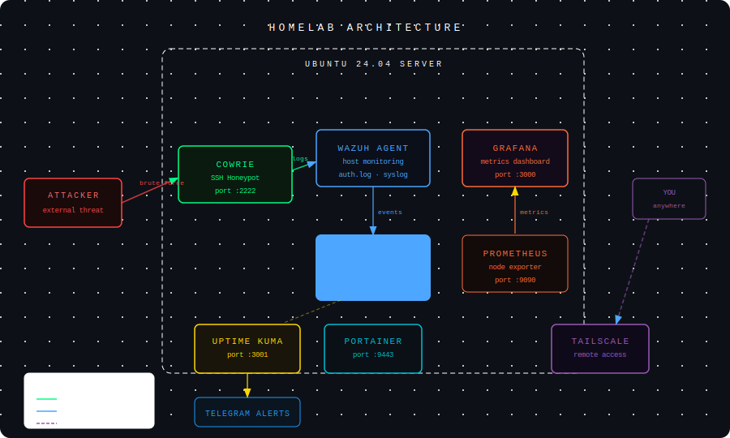

# homelab

Personal cybersecurity homelab running on a headless Ubuntu 24.04 server. Built to practice threat detection, log analysis, and SOC workflows using real tools.

---

## Stack

| Tool | Purpose |
|---|---|
| [Wazuh](https://wazuh.com) | SIEM — real-time threat detection, vulnerability scanning, log aggregation |
| [Cowrie](https://github.com/cowrie/cowrie) | SSH honeypot — captures attacker IPs, credentials, and commands |
| [Grafana](https://grafana.com) + [Prometheus](https://prometheus.io) | Server metrics — CPU, RAM, disk, network over time |
| [Uptime Kuma](https://github.com/louislam/uptime-kuma) | Service monitoring with Telegram alerts |
| [Portainer](https://www.portainer.io) | Docker management UI |
| [Watchtower](https://containrrr.dev/watchtower/) | Automatic container updates |
| [Tailscale](https://tailscale.com) | Remote access from anywhere |

---

## What this lab does

**Threat detection** — Wazuh monitors the host in real time. SSH brute force attempts, privilege escalation, file integrity changes, and Cowrie honeypot events all generate alerts mapped to MITRE ATT&CK techniques.

**Honeypot intelligence** — Cowrie runs on port 2222 and pretends to be a vulnerable SSH server. Every attacker IP, attempted password, and command gets logged. Real bots hit it daily.

**SOC practice** — I use the lab to simulate attacks, triage alerts in Wazuh, correlate events across log sources, and write incident reports. This mirrors a real Tier 1 SOC analyst workflow.

**Metrics and uptime** — Grafana dashboards show live server health. Uptime Kuma monitors all services and sends a Telegram message if anything goes down.

---

## Setup

### Requirements
- Ubuntu 22.04+
- Docker and Docker Compose
- 8GB+ RAM (Wazuh needs at least 4GB alone)

### 1. Install Docker
```bash
sudo apt update && sudo apt install ca-certificates curl
sudo install -m 0755 -d /etc/apt/keyrings
sudo curl -fsSL https://download.docker.com/linux/ubuntu/gpg \
  -o /etc/apt/keyrings/docker.asc
echo "deb [arch=$(dpkg --print-architecture) \
  signed-by=/etc/apt/keyrings/docker.asc] \
  https://download.docker.com/linux/ubuntu \
  $(. /etc/os-release && echo "$VERSION_CODENAME") stable" | \
  sudo tee /etc/apt/sources.list.d/docker.list
sudo apt update && sudo apt install docker-ce docker-ce-cli \
  containerd.io docker-buildx-plugin docker-compose-plugin
sudo usermod -aG docker $USER
```

### 2. Start Wazuh
```bash
git clone https://github.com/wazuh/wazuh-docker.git -b v4.11.2
cd wazuh-docker/single-node
sudo sysctl -w vm.max_map_count=262144
docker compose -f generate-indexer-certs.yml run --rm generator
docker compose up -d
```
Dashboard at `https://YOUR_IP` — default credentials in `docker-compose.yml`.

### 3. Install Wazuh agent on host
```bash
curl -s https://packages.wazuh.com/key/GPG-KEY-WAZUH | sudo gpg \
  --no-default-keyring \
  --keyring gnupg-ring:/usr/share/keyrings/wazuh.gpg --import
sudo chmod 644 /usr/share/keyrings/wazuh.gpg
echo "deb [signed-by=/usr/share/keyrings/wazuh.gpg] \
  https://packages.wazuh.com/4.x/apt/ stable main" | \
  sudo tee /etc/apt/sources.list.d/wazuh.list
sudo apt update && sudo apt install wazuh-agent
sudo sed -i 's/MANAGER_IP/YOUR_IP/' /var/ossec/etc/ossec.conf
sudo systemctl enable --now wazuh-agent
```

### 4. Deploy Cowrie honeypot
```bash
docker run -d \
  --name cowrie \
  --restart=always \
  -p 2222:2222 \
  -v cowrie-logs:/cowrie/cowrie-git/var \
  cowrie/cowrie:latest
```

### 5. Grafana + Prometheus
```bash
docker run -d --name prometheus --restart=always \
  -p 9090:9090 prom/prometheus:latest

docker run -d --name node-exporter --restart=always \
  -p 9100:9100 --pid="host" \
  -v "/:/host:ro,rslave" \
  prom/node-exporter:latest --path.rootfs=/host

docker run -d --name grafana --restart=always \
  -p 3000:3000 grafana/grafana:latest
```
Import dashboard ID `1860` in Grafana for pre-built server metrics.

### 6. Uptime Kuma
```bash
docker run -d --name uptime-kuma --restart=always \
  -p 3001:3001 -v uptime-kuma:/app/data \
  louislam/uptime-kuma:latest
```

### 7. Remote access via Tailscale
```bash
curl -fsSL https://tailscale.com/install.sh | sh
sudo tailscale up --accept-dns=false
sudo systemctl enable tailscaled
```

---

## SOC Practice — Example Incident

```
Incident ID  : INC-001
Date         : 2026-03-20
Source IP    : 192.168.0.102
Attack type  : SSH Brute Force
Attempts     : 20 login attempts in 45 seconds
Outcome      : Contained by Cowrie honeypot
Real system  : Not affected
MITRE ATT&CK : T1110.001 — Password Guessing
```

---

## Skills

`Docker` `Linux` `SIEM` `Wazuh` `Threat Detection` `Honeypot` `Log Analysis` `Incident Response` `Grafana` `Prometheus` `SOC Workflow` `Network Security`
